<div align="center">



# Hola, soy Shnimlz 👋

**Aprendo construyendo. Mi lenguaje principal es TypeScript.**

Bots para Discord · Desarrollo web · Proyectos en evolución

[Amayo.me](https://amayo.me)

</div>

---

### 🧭 Detrás del código

Dedico la mayor parte de mi trabajo actual a **DDC** y **Amayo.me**. Son los proyectos en los que sigo aprendiendo mientras desarrollo el bot y su experiencia web.

Gran parte de lo que he aprendido viene de **Gemini, GPT, GML y documentación que ya existía antes de la IA**. Estas herramientas y recursos forman parte de mi proceso de aprendizaje; sigo teniendo cosas por entender, probar y mejorar.

### 🛠️ Mi mesa de trabajo

| Proyecto | Qué estoy construyendo |
| --- | --- |
| **DDC · Amayo** | Un bot para Discord con funciones de música y sistemas de tickets. Trabajo principalmente con TypeScript, Node.js y Discord.js. |
| **Amayo.me** | La web y el panel de Amayo, con herramientas para editar mensajes y plantillas de Discord. Utilizo TypeScript, Svelte y SvelteKit. |

Los repositorios de estos dos proyectos son privados. Puedes conocer la web en **[amayo.me](https://amayo.me)**.

<details>
<summary><strong>🧰 Abrir la caja de herramientas</strong></summary>

### Tecnologías presentes en mis proyectos

**TypeScript** es el lenguaje que más uso. Estas son algunas de las herramientas con las que trabajo en DDC y Amayo.me:

| Uso | Herramientas |
| --- | --- |
| Bot y backend | Node.js · Discord.js · Express |
| Web e interfaz | Svelte · SvelteKit · Tailwind CSS |
| Datos | PostgreSQL · Drizzle ORM · Redis |
| Desarrollo y pruebas | pnpm · Vite · Vitest |

</details>

<details>
<summary><strong>🌱 Lo que quiero seguir mejorando</strong></summary>


- Entender mejor el código y las decisiones detrás de cada implementación.
- Corregir errores y hacer más cómoda la experiencia de uso.
- Seguir conectando las funciones de Amayo con su panel web.

</details>

### 🐍 Un recorrido por mis contribuciones

<picture>
  <source media="(prefers-color-scheme: dark)" srcset="https://raw.githubusercontent.com/Shnimlz/shnimlz/output/github-contribution-grid-snake-dark.svg" />
  <source media="(prefers-color-scheme: light)" srcset="https://raw.githubusercontent.com/Shnimlz/shnimlz/output/github-contribution-grid-snake.svg" />
  
</picture>

<details>
<summary>🎮 Una pausa entre commits</summary>

**Checkpoint guardado.** Puedes cerrar esta pestaña, estirarte y volver con otra idea.

```typescript
// Una pequeña nota para este perfil.
const siguientePaso = 'seguir aprendiendo';
```

</details>

---

<div align="center">
  <sub>Este perfil refleja lo que estoy construyendo y aprendiendo hoy.</sub>
</div>
